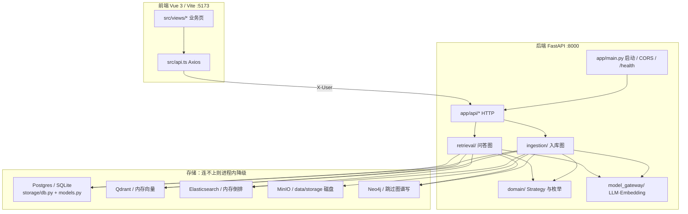
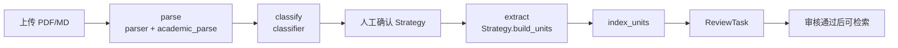
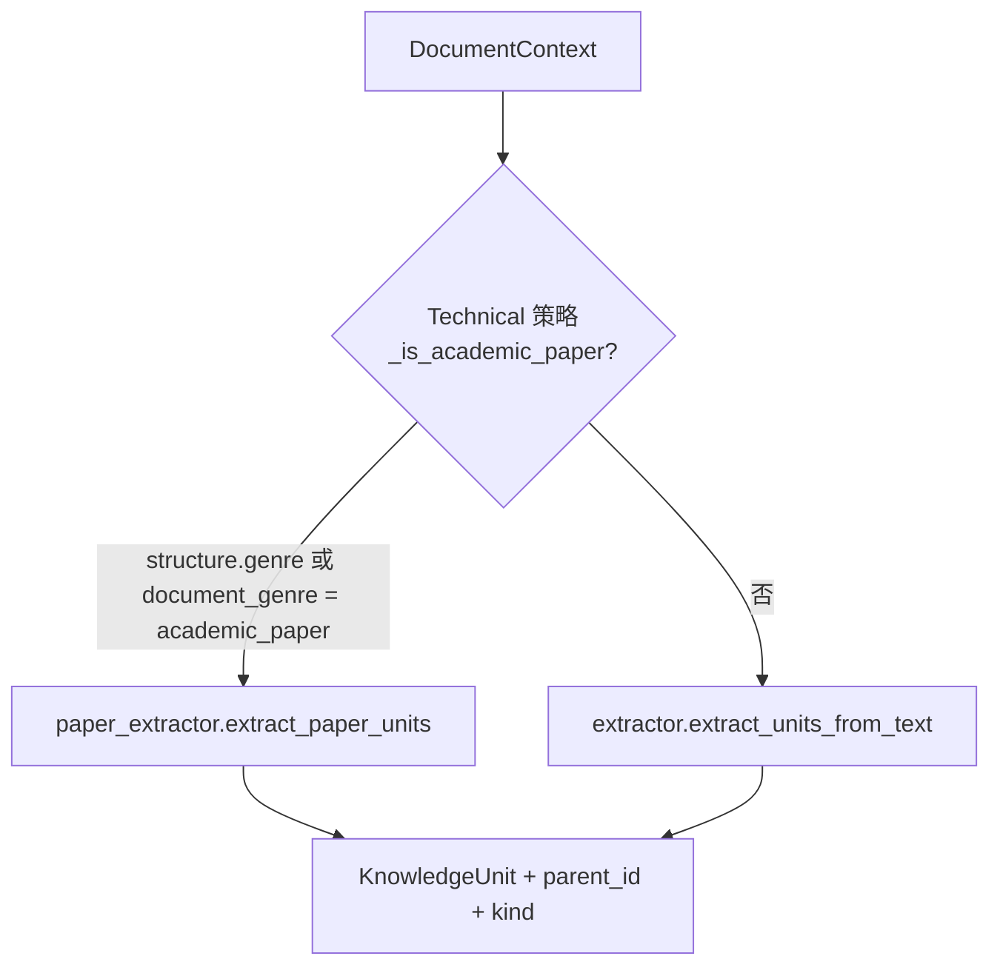
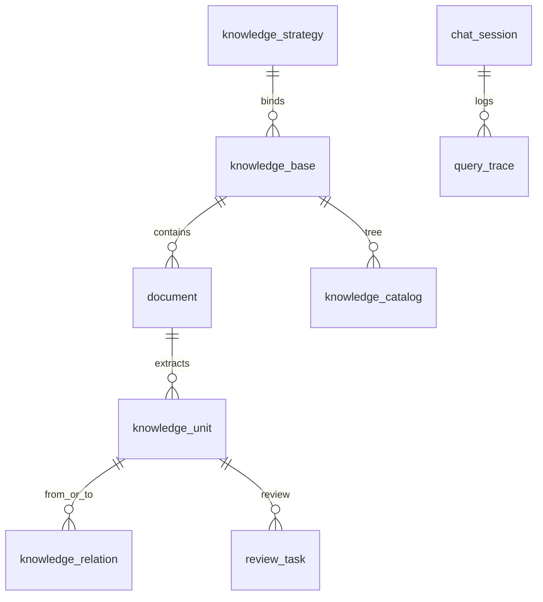

# Adaptive Knowledge RAG 整体架构图

本文对应**当前代码实现**，用来定位问题该改哪个文件。设计愿景见 [架构方案.md](./架构方案.md)；学术论文 P0 落地见 [专业知识文档落地方案.md](./专业知识文档落地方案.md)。

接口前缀 `/api`（后端 `http://127.0.0.1:8000`）。前端 Vite `5173` 把 `/api` 代理到后端。OpenAPI：`http://127.0.0.1:8000/docs`。

---

## 1. 系统鸟瞰



产品不是「切片 → 向量 → 问答」一条流水线，而是：

1. **按知识类型选 Strategy**（技术概念 / 规格 / 事故 / API）
2. **入库**把文档变成带 Role 的 Knowledge Unit，审核后再进检索索引
3. **问答**按意图做 Retrieval Plan，混合召回 + 完整性检查后再生成答案

---

## 2. 运行时与降级

启动入口：根目录 `main.py` 转调 `backend/app/main.py` 的 `create_app()`。`lifespan` 里：`init_db` → 构造 `AppStores` → `seed_if_empty`。

| 依赖 | 配置 | 不可用时 |
| --- | --- | --- |
| 关系数据库 | `DATABASE_URL` | 自动改 SQLite `./data/akrag.db` |
| Qdrant | `QDRANT_URL` | `QdrantStore._memory` |
| Elasticsearch | `ELASTICSEARCH_URL` | `ElasticStore._local` |
| MinIO | `MINIO_*` + `STORAGE_DIR` | 始终落盘 `data/storage`；MinIO 可达再多写一份 |
| Neo4j | `NEO4J_*` | `available=False`，关系仍写 SQL `knowledge_relation` |
| LLM | `MODEL_API_KEY` | 分类/抽取/问答走启发式，不阻塞演示 |

配置集中在 `backend/app/config.py`（读仓库根 `.env`）。依赖注入：`backend/app/deps.py` 的全局 `stores` + `current_user`（请求头 `X-User`）。

---

## 3. 两条主链路

### 3.1 知识入库

页面：`DocumentView.vue`。HTTP：`api/documents.py`。编排：`ingestion/workflow.py`（LangGraph）。



节点对应代码：

| 节点 | 做什么 | 关键文件 |
| --- | --- | --- |
| parse | bytes → `Document.structure`（text/pages/genre/图公式表引用） | `parser.py` → PDF 走 `academic_parse.py` |
| classify | `knowledge_type` + `document_genre`，推荐 Strategy | `classifier.py`；体裁以 parse 的 `genre` 为准 |
| extract | 按 Strategy 抽 Unit；论文走 `extract_paper_units` | `strategies/technical.py`、`paper_extractor.py`、`extractor.py` |
| 资产 | 图/公式 bbox 裁 PNG 进 MinIO | `assets.py` + `academic_parse.render_region_png` |
| index | SQL + Qdrant payload + ES 关键字 + 可选 Neo4j | `workflow.index_units`、`domain/payload.py` |
| 覆盖率 | 缺图/公式/角色则补 stub | `coverage.py` |
| 审核门槛 | 高风险 Role 必须人工审 | `validator.py` |

**论文 vs 普通文档（抽取分叉）**



向导里的 `chunk_policy` / `max_context_tokens` 只存在 `document.structure.process_config`，**当前抽取器不读取**。真正切分由上面这条分叉决定。

### 3.2 自适应问答

页面：`ChatView.vue`。HTTP：`api/chat.py`。编排：`retrieval/workflow.py`。


召回通道（RRF 融合，`retrieval/fusion.py`）：

1. Qdrant 向量（`roles` 是 **boost 不是 must 过滤**）
2. ES / SQL 关键字
3. `query_anchor_keys`：问 Fig. 3 / Eq. 2 时按 `fig:3`、`eq:2` 精确命中
4. `_expand_neighbors`：SQL 一跳关系 + `parent_id` 回溯章节

意图 → 必召 Role 映射在 `domain/enums.py` 的 `INTENT_ROLE_MAP`。Planner 步骤可被库表 `retrieval_planner_config` 覆盖（`retrieval/planner.py`）。

---

## 4. 数据落在哪



| 存储 | 内容 | 读写文件 |
| --- | --- | --- |
| SQL `document` | 原文结构、分类、向导配置、关键字索引 | `models.py`、`documents.py` |
| SQL `knowledge_unit` | 语义单元；`unit_meta.kind` 区分 section/figure/equation/table/citation | `workflow.py`、`units.py` |
| SQL `knowledge_relation` | BELONGS_TO / HAS_FIGURE / ILLUSTRATES 等 | `workflow.extract` |
| Qdrant | 向量 + payload（kind/anchor/parent_id） | `qdrant_store.py`、`payload.py` |
| ES | 关键字倒排 | `es_store.py` |
| MinIO | 原文 `originals/` + 截图 `images/{doc_id}/` | `minio_store.py`、`assets.py`、`GET /documents/{id}/assets` |
| Neo4j | 概念-单元图（可选） | `neo4j_store.py`、`api/graph.py` |

图/公式**没有独立表**，与章节同一 `knowledge_unit`，靠 `unit_meta`。

---

## 5. 仓库目录

```text
adaptiveKnowledgeRAG/
├── backend/app/           # FastAPI 应用
│   ├── main.py            # 组装 App、lifespan、CORS
│   ├── config.py          # 环境变量
│   ├── deps.py            # stores / 当前用户
│   ├── seed.py            # 空库演示数据与 Golden Case
│   ├── api/               # HTTP
│   ├── domain/            # 类型、Strategy、Ontology
│   ├── ingestion/         # 解析 → 分类 → 抽取 → 索引
│   ├── retrieval/         # 问答图、融合、文档关键字索引
│   ├── completeness/      # 答案是否够完整
│   ├── model_gateway/     # LLM / embedding / rerank
│   ├── storage/           # DB 与中间件客户端
│   └── observability/     # OpenTelemetry
├── backend/prompts/       # Prompt YAML（可被模型中心覆盖）
├── backend/tests/
├── backend/fixtures/      # 示例芯片文档
├── backend/workers/       # 独立 seed 脚本
├── frontend/src/          # 控制台
├── docs/                  # 方案与本图
└── scripts/               # 跨平台 deploy/start/stop
```

---

## 6. 后端文件职责

改代码时先看「何时打开」列。

### 6.1 启动与配置

| 文件 | 作用 | 何时打开 |
| --- | --- | --- |
| `backend/app/main.py` | FastAPI 工厂、CORS、挂 `/api`、初始化 stores 与 seed | 启动失败、跨域、健康检查 |
| `backend/app/config.py` | 全部连接串与模型名 | 连错库、模型不调 |
| `backend/app/deps.py` | 全局 `AppStores`、`X-User` 鉴权 | 401、stores not initialized |
| `backend/app/seed.py` | 演示用户/KB/文档/Golden Case | 空库无数据、评估集 |
| `backend/app/__init__.py` | 包标记 | — |
| 根 `main.py` | 兼容入口，指定 `app_dir=backend` | 直接 `python main.py` |

### 6.2 HTTP `backend/app/api/`

| 文件 | 前缀 | 作用 | 何时打开 |
| --- | --- | --- | --- |
| `__init__.py` | `/api` | 汇总 router | 新接口未挂上 |
| `documents.py` | `/documents` | 上传、分析、确认策略、启停删、资产 PNG | 上传失败、出图 404 |
| `units.py` | `/knowledge-units` | 单元列表/详情、审核通过拒绝 | 审核状态、lifecycle |
| `chat.py` | `/chat` | 会话 CRUD、提问、trace | 问答入口、引用结构 |
| `kb.py` | `/knowledge-bases` | 知识库与目录树 | 目录页、ACL 范围 |
| `strategies.py` | `/strategies` | Strategy / Role CRUD、预览 | 策略中心 |
| `retrieval.py` | `/retrieval` | 文档关键字/元数据索引、Planner 配置 | 检索中心 |
| `evaluation.py` | `/evaluation` | Golden Case、跑评估 | 评估中心 |
| `graph.py` | `/graph` | 从 SQL 关系拼前端图 | 图谱页空 |
| `dashboard.py` | `/dashboard` | 健康度、任务列表 | 工作台数字不对 |
| `prompts.py` | `/prompts` | Prompt 模板读写/试跑 | 模型中心 |
| `admin.py` | `/admin` | 用户、ACL、健康 | 系统管理 |
| `schemas.py` | — | Pydantic 请求体 | 400 校验 |

### 6.3 领域 `backend/app/domain/`

| 文件 | 作用 | 何时打开 |
| --- | --- | --- |
| `enums.py` | KnowledgeType、Role、生命周期、意图、关系类型、`INTENT_ROLE_MAP` | 新 Role/关系、对比意图 |
| `strategy.py` | `DocumentContext`、Draft、Plan、Strategy Protocol | 抽取/检索契约 |
| `registry.py` | knowledge_type → 运行时 Strategy | 策略路由错（事故走了技术抽取） |
| `strategies/technical.py` | 技术知识；论文走 `extract_paper_units` | 论文被切成普通段落 |
| `strategies/incident.py` | 故障案例 Role 与切块 | 事故文档抽取 |
| `strategies/api_doc.py` | API 文档 Role 与切块 | OpenAPI 类文档 |
| `payload.py` | 入库与审核重索引共用的向量 payload | Qdrant 缺 kind/anchor |
| `ontology.py` | 半导体目录树种子 | seed 目录 |
| `roles.py` | Role 展示名/颜色/关键词 | 策略预览标注 |
| `strategies/__init__.py` | 包 | — |

### 6.4 入库 `backend/app/ingestion/`

| 文件 | 作用 | 何时打开 |
| --- | --- | --- |
| `workflow.py` | LangGraph：parse/classify/extract/index；写 parent_id、关系、审核任务 | 整条入库断点、状态机 |
| `parser.py` | 按扩展名分流：md/txt/html vs PDF | 非 PDF 解析、genre 首次写入 |
| `academic_parse.py` | IEEE 双栏、章节、图/公式/表/引用、裁 PNG | 体裁判错、图框错、公式漏 |
| `classifier.py` | LLM + 启发式标 knowledge_type / document_genre | 推荐策略不对 |
| `paper_extractor.py` | 论文：元数据+章节+清单单元，再按章 LLM 语义抽 | 图公式没成 Unit、Vision 描述 |
| `extractor.py` | 普通文档：空行/约 180 字切块 + Role 启发式 | 非论文切块太碎/太长 |
| `assets.py` | 把 figure/equation bbox 写成 MinIO key | 聊天/审核不出图 |
| `coverage.py` | 覆盖率与 retrieval_ready；缺项补 stub | 论文缺公式清单 |
| `validator.py` | 高风险 Role 强制审核 | 不该发布的直接 PUBLISHED |
| `__init__.py` | 对外 re-export | — |

### 6.5 检索 `backend/app/retrieval/` 与完整性

| 文件 | 作用 | 何时打开 |
| --- | --- | --- |
| `workflow.py` | 问答 LangGraph；锚点精确查、邻接扩展、引用带 image_key | 召回不到 Fig/Eq、答案无图 |
| `planner.py` | 读 `retrieval_planner_config`，否则默认步骤 | Planner 配置不生效 |
| `fusion.py` | RRF 融合多路 hit | 排序异常 |
| `doc_index.py` | 文档级关键字/元数据 blob | 检索中心增改删关键字 |
| `completeness/checker.py` | 缺 Role 则二次检索 | 老是二次检索或从不补召 |
| `completeness/__init__.py` | 包 | — |

### 6.6 存储 `backend/app/storage/`

| 文件 | 作用 | 何时打开 |
| --- | --- | --- |
| `models.py` | 全部 SQLAlchemy 表 | 加字段、看 lifecycle/unit_meta |
| `db.py` | Engine、SQLite 降级、轻量 ALTER | 启动建表、缺列 |
| `qdrant_store.py` | upsert/search；无服务走内存 | 向量召回空 |
| `es_store.py` | 关键字索引 | 关键词搜不到 |
| `minio_store.py` | 对象存取 | 原件/PNG 丢失 |
| `neo4j_store.py` | 可选图写入 | 图谱与 SQL 不一致 |
| `__init__.py` | 包 | — |

Qdrant/ES 检索里 **`roles` 只 boost，不要改回 must 硬过滤**，否则图/公式单元会被意图 Role 滤掉。

### 6.7 模型、可观测、脚本

| 文件 | 作用 | 何时打开 |
| --- | --- | --- |
| `model_gateway/gateway.py` | chat_json / vision / embedding / rerank；无 key 启发式 | 模型超时、Vision 空、分类全启发式 |
| `observability/metrics.py` | Tracer；`APP_ENV=debug` 才打控制台 span | 链路追踪 |
| `workers/tasks.py` | 独立跑 `seed_all` | 手动灌库 |
| `backend/scripts/smoke_ingest.py` | 入库冒烟 | 本地验证抽取 |
| `backend/tests/test_academic_paper.py` | 论文解析/体裁/召回回归 | 改 academic_parse / retrieval |
| `backend/tests/test_strategy.py` | Strategy / ontology | 改 registry |

### 6.8 Prompt YAML `backend/prompts/`

运行时可被 `prompt_template` 表覆盖（模型中心）。改「模型怎么说话」先改 YAML，再确认库里是否有旧模板挡住。

| 文件 | 被谁用 |
| --- | --- |
| `knowledge-classifier.yaml` | `classifier.py` |
| `technical-extractor.yaml` | `paper_extractor.py` 章节语义抽 |
| `figure-interpreter.yaml` | 图/公式 Vision |
| `query-understanding.yaml` | `retrieval/workflow.understand` |
| `retrieval-planner.yaml` | Planner（若走 LLM） |
| `completeness-checker.yaml` | 完整性（checker 内也内嵌了系统提示） |
| `answer-generator.yaml` | `workflow.answer` |

---

## 7. 前端文件职责

| 文件 | 作用 | 何时打开 |
| --- | --- | --- |
| `src/main.ts` | 挂载 Vue / Pinia / 路由 / AntD | 白屏启动 |
| `src/App.vue` | 根组件 | — |
| `src/router.ts` | 路由表 | 新页面 404 |
| `src/api.ts` | Axios 基址 `/api`、错误提示、注入 `X-User` | 所有接口失败、用户身份 |
| `src/stores/session.ts` | 当前用户与角色菜单 | 菜单缺项 |
| `src/layouts/AppLayout.vue` | 侧栏布局 | 导航/响应式 |
| `src/styles.css` | 全局样式 | 视觉回归 |
| `src/views/DashboardView.vue` | 工作台 | dashboard API |
| `src/views/ChatView.vue` | 问答、引用 Tab、出图 | 答案/引用/图片 |
| `src/views/DocumentView.vue` | 上传向导 | 分析/确认策略 |
| `src/views/ReviewView.vue` | 对照原文审核、图预览 | 审核流 |
| `src/views/KnowledgeBaseView.vue` | 知识库列表 | kb API |
| `src/views/CatalogView.vue` | 目录思维导图 | catalog API |
| `src/views/UnitDetailView.vue` | 单单元详情 | units GET |
| `src/views/StrategyView.vue` | 策略与 Role | strategies API |
| `src/views/PromptView.vue` | Prompt 编辑 | prompts API |
| `src/views/RetrievalView.vue` | 文档索引 + Planner | retrieval API |
| `src/views/EvaluationView.vue` | 评估与 Golden | evaluation API |
| `src/views/GraphView.vue` | 关系图 | graph API |
| `src/views/AdminView.vue` | 用户与 ACL | admin API |
| `src/components/MindMap.vue` / `MindBranch.vue` | 目录导图控件 | 导图渲染 |
| `vite.config.ts` | 端口与 `/api` 代理 | 前端调不通后端 |

---

## 8. 页面 → API → 实现

| 前端路由 | Vue | API | 核心实现 |
| --- | --- | --- | --- |
| `/` | DashboardView | `/dashboard` | `dashboard.py` |
| `/chat` | ChatView | `/chat` | `chat.py` → `QueryWorkflow` |
| `/documents` | DocumentView | `/documents` | `documents.py` → `IngestionWorkflow` |
| `/review` | ReviewView | `/knowledge-units` | `units.py`；重索引走 `payload.py` |
| `/knowledge-bases` | KnowledgeBaseView | `/knowledge-bases` | `kb.py` |
| `/catalog` | CatalogView | `/knowledge-bases/{id}/catalog` | `kb.py` + `ontology.py` 种子 |
| `/strategies` | StrategyView | `/strategies` | `strategies.py` + `roles.py` |
| `/retrieval` | RetrievalView | `/retrieval` | `retrieval.py` + `doc_index.py` |
| `/evaluation` | EvaluationView | `/evaluation` | `evaluation.py` + `seed.py` Golden |
| `/graph` | GraphView | `/graph` | `graph.py` + `knowledge_relation` |
| `/prompts` | PromptView | `/prompts` | `prompts.py` + YAML |
| `/admin` | AdminView | `/admin` | `admin.py` |

---

## 9. 按症状定位

| 现象 | 先看 |
| --- | --- |
| 上传后体裁不是论文 / 是论文 | `academic_parse.looks_like_academic_paper` ← `parser.parse_bytes` ← `workflow.parse` |
| 推荐了错误 Strategy | `classifier.py`；人工覆盖在 `workflow.classify` 的 `confirmed_strategy` |
| 论文被切成短句而不是章节+图公式 | `technical.py` `_is_academic_paper`；确认 `structure.genre` |
| 切块策略单选无效 | 预期：尚未接入抽取器，只存在 `process_config` |
| 缺 Fig/Eq 单元或没有 PNG | `academic_parse` bbox → `assets.py` → `paper_extractor` kind |
| Vision 图描述为空 | `paper_extractor` + `figure-interpreter.yaml` + `gateway.chat_vision_json`（需 API key） |
| 审核通过后搜不到 | `units.py` 重索引 payload；`qdrant_store` lifecycle 是否含 APPROVED/PUBLISHED |
| 问「Fig. 3」召不中 | `retrieval/workflow.py` `query_anchor_keys` / `_anchor_exact_hits`；勿给 roles 加 must 过滤 |
| 答案有字无图 | `answer-generator.yaml`；citation 的 `image_key`；`documents.get_document_asset`；`ChatView` blob |
| 图谱空 | 先查 SQL `knowledge_relation`；Neo4j 仅增强，`graph.py` 主要读 SQL |
| 无 Docker 功能缺一块 | 对应 `*_store.py` 的 `available` / `_local`；Postgres 失败见 `db.py` SQLite 降级 |
| 模型中心改 prompt 不生效 | 库表 `prompt_template` 是否覆盖 YAML |
| 菜单看不到某页 | `stores/session.ts` `ROLE_MENUS` |

文档状态机（`enums.DocumentStatus`）：`uploaded` → `parsing` → `awaiting_strategy` → `extracting` → `review` / `indexed` / `failed`。卡在哪一态就查 `workflow.py` 对应节点。

单元生命周期（`KnowledgeLifecycle`）：高风险 Role 进 `PENDING_REVIEW`（`validator.py`）；检索默认放行 `PUBLISHED` 与 `APPROVED`。

---

## 10. 相关文档

| 文档 | 内容 |
| --- | --- |
| [架构方案.md](./架构方案.md) | 产品设计愿景（长文，含未实现能力） |
| [专业知识文档方案设计.md](./专业知识文档方案设计.md) | 论文知识建模需求 |
| [专业知识文档落地方案.md](./专业知识文档落地方案.md) | P0 已落地改造与 P1/P2 |
| [切分策略修改.md](./切分策略修改.md) | 向导切分 vs 真实抽取 |
| [前端布局与产品体验评审.md](./前端布局与产品体验评审.md) | UI 评审 |
| [页面原型.md](./页面原型.md) | 页面原型 |
