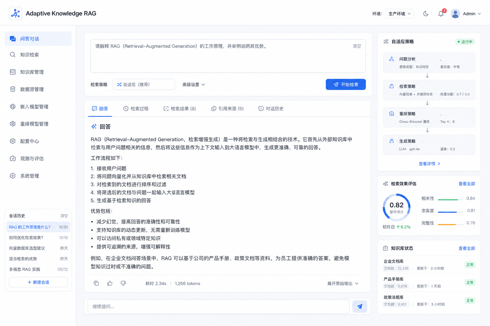

可以。这个系统前端我建议**不要设计成传统“上传文档 → 聊天问答”知识库界面**，而应该体现 Adaptive Knowledge RAG 的核心能力：

> **知识如何进入系统 → AI 如何理解 → 采用什么策略 → 如何构建知识单元 → 如何建立索引 → 用户问题如何规划检索 → 找到了哪些知识 → 是否完整 → 最终答案来自哪里。**

下面我直接按一套可落地的企业后台产品来设计。


# Adaptive Knowledge RAG 前端页面操作原型设计

我建议整个产品不要做成单纯的：

```text
知识库
 ├── 上传文档
 └── AI 问答
```

而是设计成一个能够让管理员、知识专家和普通用户分别使用的 **企业级知识智能平台**。

整体可以分成三个工作空间：

```text
┌─────────────────────────────────────┐
│          Adaptive Knowledge RAG     │
├─────────────┬───────────┬───────────┤
│ Knowledge   │ Retrieval │ Evaluation│
│ Studio      │ Studio    │ & Ops     │
│             │           │           │
│ 知识构建     │ 智能问答   │ 评估治理   │
└─────────────┴───────────┴───────────┘
```

---

# 一、整体导航设计

左侧一级菜单建议如下：

```text
🏠 工作台

💬 智能问答
   ├── 问答对话
   └── 检索分析

📚 知识库管理
   ├── 知识库
   ├── 文档管理
   ├── 知识目录
   └── 知识单元

🧠 自适应策略
   ├── 知识类型
   ├── Knowledge Strategy
   ├── Ontology
   └── Prompt / Skill

🔍 检索管理
   ├── Retrieval Planner
   ├── 检索策略
   ├── Reranker
   └── 索引管理

🕸 知识关系
   ├── Knowledge Graph
   └── 关系管理

📊 评估中心
   ├── 检索评估
   ├── 回答评估
   ├── 完整性评估
   └── Golden Dataset

⚙ 系统管理
   ├── 模型管理
   ├── Prompt 管理
   ├── 权限管理
   └── 系统配置
```

前端首页的核心效果可以参考刚才生成的方向：左侧是系统导航，中间是知识问答和检索过程，右侧实时展示当前 AI 选择的自适应策略、检索效果和知识库状态。

---

# 二、首页：Adaptive Knowledge Dashboard

首页不是展示简单的：

```text
知识库数量：10
文档数量：1000
```

而应该展示整个知识系统的运行状态。

---

## 页面布局

```text
┌──────────────────────────────────────────────────────────────┐
│ Adaptive Knowledge RAG                         🔔 Admin      │
├──────────────┬───────────────────────────────────────────────┤
│              │                                               │
│ 🏠 工作台     │   Knowledge Health                            │
│              │                                               │
│ 💬 智能问答   │  ┌────────┐ ┌────────┐ ┌────────┐            │
│              │  │知识库   │ │知识单元 │ │待审核   │            │
│ 📚 知识库     │  │  12    │ │128,391 │ │   34   │            │
│              │  └────────┘ └────────┘ └────────┘            │
│ 🧠 策略中心   │                                               │
│              │   ┌──────────────────────────────┐            │
│ 🔍 检索管理   │   │ 最近知识处理任务              │            │
│              │   │                              │            │
│ 🕸 知识图谱   │   │ 芯片设计规范.pdf             │            │
│              │   │ ━━━━━━━━━━━━━━━  92%         │            │
│ 📊 评估中心   │   └──────────────────────────────┘            │
│              │                                               │
│ ⚙ 系统管理   │   Knowledge Quality                           │
│              │                                               │
│              │   Recall        91%                           │
│              │   Precision     94%                           │
│              │   Coverage      88%                           │
│              │   Groundedness  97%                           │
└──────────────┴───────────────────────────────────────────────┘
```

---

# 三、知识库管理页面

这是管理员的核心操作页面。

```text
┌───────────────────────────────────────────────────────────┐
│ 知识库管理                         [+ 创建知识库]          │
├───────────────────────────────────────────────────────────┤
│                                                           │
│ 🔍 搜索知识库                                              │
│                                                           │
│ ┌─────────────────────────────────────────────────────┐   │
│ │ 🧠 芯片设计知识库                                     │   │
│ │                                                     │   │
│ │ Semiconductor / Technical Knowledge                 │   │
│ │                                                     │   │
│ │ 文档：2,341                                         │   │
│ │ Knowledge Unit：128,291                             │   │
│ │ Strategy：Technical Knowledge V2                    │   │
│ │                                                     │   │
│ │ 状态：🟢 正常                  [进入] [设置]          │   │
│ └─────────────────────────────────────────────────────┘   │
│                                                           │
│ ┌─────────────────────────────────────────────────────┐   │
│ │ 📜 企业历史知识库                                     │   │
│ │                                                     │   │
│ │ Historical Knowledge                                 │   │
│ │                                                     │   │
│ │ Strategy：Historical Event V1                        │   │
│ └─────────────────────────────────────────────────────┘   │
└───────────────────────────────────────────────────────────┘
```

这里最重要的是：

```text
知识库名称
+
Knowledge Type
+
Strategy
```

让管理员可以看到：

> 这个知识库当前采用什么知识理解策略。

---

# 四、创建知识库页面

这个页面我建议做成一个向导。

---

## Step 1：基础信息

```text
创建知识库

Step 1 —— 基础信息
Step 2 —— 知识分析
Step 3 —— Strategy
Step 4 —— Index
Step 5 —— Review


知识库名称：

[ 芯片设计知识库                    ]

描述：

[ 存储芯片设计相关专业知识          ]

业务领域：

[ Semiconductor                ▼ ]

访问权限：

● 企业公开

○ 指定部门

○ 指定项目
```

---

# 五、Step 2：AI 知识分析

这是 Adaptive Knowledge RAG 的特色页面。

管理员上传文档：

```text
┌────────────────────────────────────┐
│                                    │
│          拖拽文档到这里             │
│                                    │
│        PDF DOCX PPT MD HTML        │
│                                    │
│             [上传文件]             │
└────────────────────────────────────┘
```

上传后不是直接：

```text
上传成功
```

而是展示 AI 分析。

```text
AI 正在分析知识结构...

████████████████░░░ 82%

✓ 文档结构识别

✓ 章节目录提取

✓ 表格识别

✓ 专业术语识别

✓ 知识类型识别

正在分析：
Knowledge Ontology...
```

最终：

```text
AI 分析结果

主要知识类型：

☑ Technical Specification     82%

☑ Technical Concept           12%

☑ Incident Case                6%

推荐 Strategy：

┌──────────────────────────────────┐
│ Technical Knowledge Strategy V2  │
│                                  │
│ Definition                      │
│ Principle                       │
│ Formula                         │
│ Constraint                      │
│ Parameter                       │
│ Example                         │
│ Exception                       │
└──────────────────────────────────┘

[接受推荐]     [手动调整]
```

这里非常重要：

> AI 推荐，而不是 AI 强制决定。

---

# 六、Strategy 配置页面

这是整个产品的核心页面之一。

页面可以设计成：

```text
┌─────────────────────────────────────────────────────┐
│ Knowledge Strategy                                  │
├─────────────────────────────────────────────────────┤
│                                                     │
│ Strategy：Technical Knowledge V2                    │
│                                                     │
│ ┌───────────────────────────────────────────────┐   │
│ │ Knowledge Structure                           │   │
│ │                                               │   │
│ │  Concept                                      │   │
│ │     │                                         │   │
│ │     ├── Definition        ☑                   │   │
│ │     ├── Explanation       ☑                   │   │
│ │     ├── Principle         ☑                   │   │
│ │     ├── Formula           ☑                   │   │
│ │     ├── Constraint        ☑                   │   │
│ │     ├── Parameter         ☑                   │   │
│ │     ├── Example           ☑                   │   │
│ │     ├── Exception         ☑                   │   │
│ │     └── Reference         ☑                   │   │
│ └───────────────────────────────────────────────┘   │
│                                                     │
│ [+ 添加 Knowledge Role]                             │
│                                                     │
│ [保存 Strategy]                                     │
└─────────────────────────────────────────────────────┘
```

管理员可以自己配置企业内部知识模型。

例如：

```text
Technical Knowledge V2

Definition
Explanation
Design Rule
Internal Rule
Chip Constraint
Customer Requirement
Known Issue
Best Practice
```

这就允许：

> 不同企业拥有不同的知识结构。

---

# 七、Knowledge Ontology 页面

这是知识目录树。

对于芯片知识库：

```text
知识目录

Semiconductor
│
├── Digital Design
│   │
│   ├── RTL Design
│   │   ├── FSM
│   │   ├── Pipeline
│   │   └── CDC
│   │
│   └── Timing Analysis
│       ├── Setup Time
│       ├── Hold Time
│       └── Clock Skew
│
├── Physical Design
│   ├── Floorplan
│   ├── Placement
│   └── CTS
│
└── DFT
    ├── Scan
    ├── ATPG
    └── MBIST
```

右侧点击：

```text
CDC
```

展示：

```text
Topic：CDC

Domain：
Digital Design

Parent：
RTL Design

Related Concepts：

• Metastability
• Synchronizer
• Async FIFO
• Gray Code

Knowledge Units：

Definition       3
Principle        8
Constraint       12
Example          15
Incident         6

[查看知识] [编辑关系]
```

---

# 八、最重要的页面：AI 知识切分审核

这个页面建议做成**左右对照模式**。

```text
┌────────────────────────────────────────────────────────────┐
│ 文档原文                       AI Knowledge Units          │
├──────────────────────┬─────────────────────────────────────┤
│                      │                                     │
│ 3.2 Setup Time       │ 🟦 Definition                       │
│                      │                                     │
│ Setup Time 是指...   │ Setup Time 是数据在时钟边沿前...     │
│                      │                                     │
│                      │ Importance：Core                    │
│                      │ Confidence：96%                     │
│                      │                                     │
│ ------------------   │ [✓ Accept] [✎ Edit] [✕ Reject]      │
│                      │                                     │
│ 例如，如果 Clock...  │ 🟨 Example                           │
│                      │                                     │
│ ...                  │ Clock=10ns                          │
│                      │ Setup=2ns                           │
│                      │                                     │
│                      │ Parent：Setup Time                  │
│                      │                                     │
└──────────────────────┴─────────────────────────────────────┘
```

这里的审核非常关键。

特别是：

```text
Rule
Constraint
Formula
Exception
```

可以设置：

```text
必须人工审核
```

而：

```text
Example
Explanation
Reference
```

允许：

```text
自动发布
```

---

# 九、知识单元详情页

点击某个 Knowledge Unit。

```text
┌──────────────────────────────────────────────┐
│ Setup Time                                   │
│                                              │
│ Type：Technical Concept                      │
│ Role：Definition                             │
│ Status：Approved                             │
│ Version：V3                                  │
├──────────────────────────────────────────────┤
│                                              │
│ 【Definition】                               │
│                                              │
│ Setup Time 是数据必须在时钟有效边沿之前...   │
│                                              │
├──────────────────────────────────────────────┤
│ Related Knowledge                            │
│                                              │
│ ← Principle                                  │
│ → Example                                    │
│ → Constraint                                 │
│ → Exception                                  │
│                                              │
│ Related Concept：                            │
│                                              │
│ Hold Time                                    │
│ Clock Period                                 │
│ Clock Skew                                   │
│                                              │
├──────────────────────────────────────────────┤
│ Source                                       │
│                                              │
│ Timing Design Guide.pdf                      │
│ Chapter 3.2                                  │
│ Page 21                                      │
└──────────────────────────────────────────────┘
```

---

# 十、知识图谱页面

这个页面适合技术专家。

```text
                    ┌──────────────┐
                    │ Setup Time   │
                    └──────┬───────┘
                           │
         ┌─────────────────┼─────────────────┐
         ▼                 ▼                 ▼

    Hold Time        Clock Period        Data Path
    RELATED_TO         AFFECTS          DEPENDS_ON

         │
         ▼

    DDR Timing
    EXCEPTION
```

左侧：

```text
节点类型：

☑ Concept
☑ Knowledge Unit
☑ Rule
☑ Component
☑ Parameter
```

顶部：

```text
[搜索节点：CDC________________]

最大层级：

[ 3 ▼ ]

关系：

[全部关系 ▼]

[展开]
```

---

# 十一、普通用户最核心页面：智能问答

这个页面建议采用：

```text
中间：回答
右侧：AI 检索过程
```

而不是把复杂信息全部展示出来。

用户：

```text
┌────────────────────────────────────┐
│ 请问如何解决 CDC 中的亚稳态问题？    │
└────────────────────────────────────┘
```

点击：

```text
[开始分析]
```

右侧显示：

```text
Adaptive Retrieval

① Query Understanding

Domain：
Semiconductor

Topic：
CDC

Intent：
Solution

Risk：
High


↓

② Retrieval Plan

需要知识：

✓ CDC Definition

✓ Metastability Cause

✓ Synchronizer

✓ Async FIFO

✓ Design Constraint


↓

③ Retrieval

Keyword Search       32

Vector Search        47

Graph Expansion      18


↓

④ Rerank

Top 97
↓

Top 12


↓

⑤ Completeness

███████████████░ 89%

⚠ 缺少：

Timing Constraint

[二次检索]
```

然后：

```text
Secondary Retrieval...

✓ Timing Constraint
```

最终：

```text
Completeness：

96%
```

这个页面就是 Adaptive Knowledge RAG 和普通 ChatRAG 最大的区别。

---

# 十二、回答页面设计

中间回答：

```text
如何解决 CDC 中的亚稳态问题？

━━━━━━━━━━━━━━━━━━━━

一、问题原因

CDC 中产生亚稳态的主要原因是...

二、解决方案

1. 单 bit 信号

推荐使用双触发器同步。

2. 多 bit 数据

推荐使用：

• Handshake
• Async FIFO

3. 高速数据

...

━━━━━━━━━━━━━━━━━━━━

设计约束

• Synchronizer Placement
• MTBF
• Timing Constraint

━━━━━━━━━━━━━━━━━━━━

知识来源

📄 CDC Design Guide
   Chapter 3.1

📄 Async FIFO Specification
   Chapter 5.2

📄 Internal Design Rule
   Rule-CDC-023
```

右侧：

```text
Answer Quality

Accuracy
█████████ 94%

Completeness
█████████ 96%

Source Authority
██████████ 100%

Confidence

● High
```

---

# 十三、点击“查看检索过程”

展开完整检索链。

```text
User Query
    │
    ▼
┌─────────────────┐
│ Query Analysis  │
└────────┬────────┘
         ▼
Domain：
Digital Design

Topic：
CDC

Intent：
Solution
         │
         ▼
┌─────────────────┐
│ Retrieval Plan  │
└────────┬────────┘
         │
         ├── CDC Definition
         │
         ├── Metastability
         │
         ├── Synchronizer
         │
         └── Async FIFO
                  │
                  ▼
             Hybrid Search
                  │
        ┌─────────┼─────────┐
        ▼         ▼         ▼
     Keyword    Vector    Graph
        │         │         │
        └─────────┼─────────┘
                  ▼
                Rerank
                  │
                  ▼
           Completeness
```

管理员可以：

```text
[重试]
[修改 Retrieval Plan]
[保存为测试用例]
```

---

# 十四、Retrieval Planner 管理页面

这个页面给算法工程师和管理员。

```text
Retrieval Planner

Query Type：

[Solution Question ▼]

Retrieval Rules：

┌──────────────────────────────────────┐
│ 1. Search Topic                      │
│                                      │
│ 2. Search Classification             │
│                                      │
│ 3. Search Solution                   │
│                                      │
│ 4. Search Constraint                 │
│                                      │
│ 5. Search Example                    │
│                                      │
│ 6. Completeness Check                │
└──────────────────────────────────────┘

[+ Add Step]
```

可以做成拖拽：

```text
┌───────────────┐
│ Query Analyze │
└───────────────┘
        ↓
┌───────────────┐
│ Catalog Route │
└───────────────┘
        ↓
┌───────────────┐
│ Hybrid Search │
└───────────────┘
        ↓
┌───────────────┐
│ Graph Expand  │
└───────────────┘
        ↓
┌───────────────┐
│ Rerank        │
└───────────────┘
```

这实际上就是：

# Retrieval Workflow Builder

后续可以支持：

```text
IF completeness < 0.8

↓

Secondary Retrieval
```

---

# 十五、Prompt / Skill 管理页面

建议做成类似企业 Prompt Registry。

```text
Prompt / Skill Center

┌──────────────────────────────────────────────────┐
│ Technical Knowledge Extractor                     │
│                                                  │
│ Version：V12                                     │
│ Status：Production                               │
│ Model：GPT / Qwen                                │
│                                                  │
│ Success Rate：94.2%                              │
│                                                  │
│ [编辑] [测试] [历史版本]                          │
└──────────────────────────────────────────────────┘
```

点击进入：

```text
Prompt Editor

┌────────────────────────┬─────────────────────────┐
│ Prompt                  │ Test Console            │
├────────────────────────┼─────────────────────────┤
│                        │                         │
│ 你是芯片知识专家...     │ Input                   │
│                        │                         │
│ 请识别：                │ [输入测试文档]          │
│                        │                         │
│ Definition             │                         │
│ Principle              │ [Run Test]              │
│ Constraint             │                         │
│ Exception              │ Output                  │
│                        │                         │
│                        │ {                       │
│                        │   "units": []           │
│                        │ }                       │
└────────────────────────┴─────────────────────────┘
```

---

# 十六、Knowledge Strategy Builder

这是我认为产品里最有价值的页面之一。

可以设计成低代码配置。

```text
Knowledge Strategy Builder


Strategy Name：

[ Technical Knowledge V2        ]


① Knowledge Type

[ Technical Knowledge ▼ ]


② Knowledge Roles

┌─────────────────────────────┐
│ ☑ Definition                │
│ ☑ Principle                 │
│ ☑ Formula                   │
│ ☑ Constraint                │
│ ☑ Example                   │
│ ☑ Exception                 │
│ ☑ Reference                 │
│                             │
│ [+ Add Role]                │
└─────────────────────────────┘


③ Chunk Policy

● Semantic Unit

○ Section

○ Fixed Token


Maximum Context：

[ 2000 Tokens ]


④ Relationship

Definition
      │
      ├── EXPLAINED_BY
      │
      ├── HAS_EXAMPLE
      │
      └── HAS_EXCEPTION
```

下面：

```text
⑤ Retrieval Policy

Definition Question

↓

Search：

☑ Metadata

☑ Keyword

☑ Vector

☐ Graph


Solution Question

↓

Search：

☑ Metadata

☑ Keyword

☑ Vector

☑ Graph


⑥ Completeness Policy

Minimum Coverage：

[ 90% ]

Low Coverage：

○ Secondary Retrieval

● Return Incomplete Warning

○ Reject Answer
```

这样 Adaptive Knowledge RAG 的核心策略就真正从：

```text
Java Code
```

变成：

```text
可配置知识策略
```

---

# 十七、评估中心

企业级系统一定需要评估页面。

---

## 检索评估

```text
┌────────────────────────────────────────────┐
│ Retrieval Evaluation                       │
├────────────────────────────────────────────┤
│                                            │
│ Recall@10              92.4%  ↑ 2.1%       │
│                                            │
│ Precision@10           89.1%               │
│                                            │
│ Knowledge Coverage     93.2%               │
│                                            │
│ Rerank Improvement     +14.8%              │
│                                            │
│ Average Latency        1.82s               │
│                                            │
└────────────────────────────────────────────┘
```

---

## 按 Strategy 分析

```text
Strategy                   Recall    Coverage

Technical Knowledge V2      94%       92%

Incident Case V1            91%       89%

API Knowledge V2            97%       96%

Historical Event V1         88%       91%
```

这很重要。

因为最终你会发现：

> 不是整个系统准确率不好。

可能是：

```text
Historical Event Strategy
```

效果不好。

于是单独优化该策略。

---

# 十八、Golden Dataset 页面

```text
Golden Dataset

[+ 新建测试集]

Question：

如何解决 CDC 亚稳态问题？


Required Knowledge：

☑ CDC Definition

☑ Metastability

☑ Synchronizer

☑ Async FIFO

☑ Timing Constraint


Forbidden Knowledge：

☒ PCIe Timing


Expected Answer：

覆盖：

• 原因

• 解决方案

• 约束


[Test]
```

运行：

```text
Test Result

Recall：

5 / 5

Coverage：

100%

Forbidden：

0

Answer Groundedness：

96%

PASS ✓
```

---

# 十九、用户角色对应页面

我建议至少分四类用户。

| 用户       | 核心页面                    |
| -------- | ----------------------- |
| 普通用户     | 智能问答、知识搜索               |
| 知识专家     | 文档审核、知识单元、知识关系          |
| AI/算法工程师 | Strategy、Prompt、检索规划、评估 |
| 系统管理员    | 知识库、模型、权限、系统监控          |

不要所有人看到同一个后台。

---

# 二十、最终产品信息架构

我建议最终收敛成：

```text
Adaptive Knowledge RAG
│
├── 🏠 Dashboard
│
├── 💬 Ask
│   ├── Chat
│   ├── Search
│   └── Retrieval Trace
│
├── 📚 Knowledge Studio
│   │
│   ├── Knowledge Base
│   ├── Documents
│   ├── Knowledge Catalog
│   ├── Knowledge Units
│   ├── Review Center
│   └── Knowledge Graph
│
├── 🧠 Strategy Studio
│   │
│   ├── Knowledge Type
│   ├── Ontology
│   ├── Strategy Builder
│   ├── Prompt / Skill
│   └── Model Binding
│
├── 🔍 Retrieval Studio
│   │
│   ├── Query Analysis
│   ├── Retrieval Planner
│   ├── Hybrid Search
│   ├── Reranker
│   └── Completeness Policy
│
├── 📊 Evaluation Center
│   │
│   ├── Golden Dataset
│   ├── Retrieval Evaluation
│   ├── Answer Evaluation
│   ├── Strategy Evaluation
│   └── Experiment
│
└── ⚙ Administration
    │
    ├── Model Gateway
    ├── Data Sources
    ├── Index
    ├── Permissions
    └── Monitoring
```

---

# 二十一、我最推荐的核心操作流程

对于一个知识专家来说：

```text
创建知识库
      ↓
上传文档
      ↓
AI 自动分析
      ↓
识别 Knowledge Type
      ↓
推荐 Strategy
      ↓
AI Semantic Chunk
      ↓
生成 Knowledge Unit
      ↓
生成 Metadata
      ↓
生成 Knowledge Relation
      ↓
人工审核关键知识
      ↓
发布
```

而用户查询：

```text
提出问题
      ↓
Query Understanding
      ↓
识别 Domain / Intent
      ↓
Strategy Selection
      ↓
Retrieval Planning
      ↓
Catalog Routing
      ↓
Hybrid Retrieval
      ↓
Rerank
      ↓
Completeness Check
      ↓
Secondary Retrieval
      ↓
生成答案
      ↓
展示来源 + 检索过程
```

---

## 下一步建议

如果要真正继续落地，我建议下一步不要直接写前端，而是继续把这个产品拆成一套**可开发的页面原型规格**。例如先输出：

1. **完整 Figma 风格页面清单**
2. **每个页面的组件树**
3. **页面之间的跳转关系**
4. **前端 API 定义**
5. **React/Vue 页面目录结构**
6. **“知识库创建 → AI 解析 → 人工审核 → 发布”的完整交互原型**
7. **“用户提问 → Adaptive Retrieval → 检索过程可视化”的完整交互原型**

其中我建议第一版 MVP 优先做 **6 个核心页面**：

```text
① Dashboard

② 知识库管理

③ 文档上传与 AI 分析

④ Knowledge Unit 审核

⑤ Adaptive Chat

⑥ Strategy Builder
```

这 6 个页面已经能够完整跑通 **“知识进入 → AI 理解 → 策略选择 → 知识审核 → 自适应检索 → 可解释回答”** 的完整闭环。
